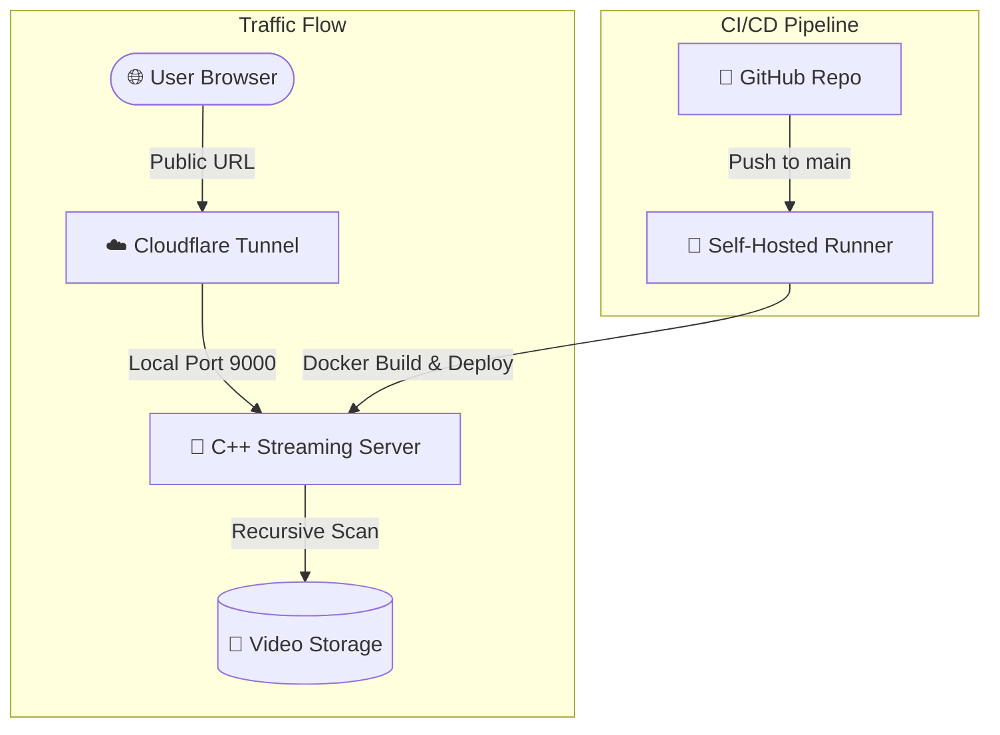

# 📽️ C++ Video Streaming Server

Live Demo: https://stream.saurav-info.xyz


A high-performance C++ backend designed for serving video content with professional optimizations. This server supports range requests (seeking), concurrent user handling via a thread pool, and zero-copy data transfer.

## 🚀 Key Features

- **🔥 Zero-Copy Streaming:** Uses Linux `sendfile` for high-performance, low-CPU file transfers.
- **🔹 Cross-Platform:** Native Win32 support for local development, Linux/POSIX for Docker/Production.
- **🧭 Smart Routing:** Automatically maps the root domain to your video library.
- **📂 Dynamic Discovery:** Recursively scans your `video/` folder for episodes and cover art.
- **📁 Extended Format Support:** Handles `.mp4`, `.mkv`, `.webp`, `.jfif`, `.avif`, and more.
- **📏 Byte-Range Support:** Enables instant seeking and scrubbing in the browser.

---

## 🏗️ System Architecture (HLD)



---

## 🛠️ Getting Started

### 🐳 Run with Docker (Recommended)
The server is optimized to run inside Docker (Linux) to take advantage of `sendfile`.

1. Point your `video/` folder to your media collection.
2. Run:
   ```bash
   docker-compose up --build -d
   ```
3. Open: `http://localhost:9000/`

### 💻 Local Development (Windows)
The server includes a Win32 fallback mode. You can compile it locally using CMake and it will use the `read/send` buffer mode for streaming.

---

## 📂 Folder Structure
- **apps/server**: Main entry point and routing logic.
- **libs/streaming**: Content discovery, range parsing, and the cross-platform streaming engine.
- **libs/network**: Raw TCP socket server implementation.
- **libs/core**: Task-based thread pool for high concurrency.
- **libs/http**: Lightweight request parsing.

---

## 🏁 Final Goal
This server aims to mimic the core logic behind how high-scale platforms like Netflix serve content—minimizing memory copies and handling thousands of small range-based requests efficiently.
